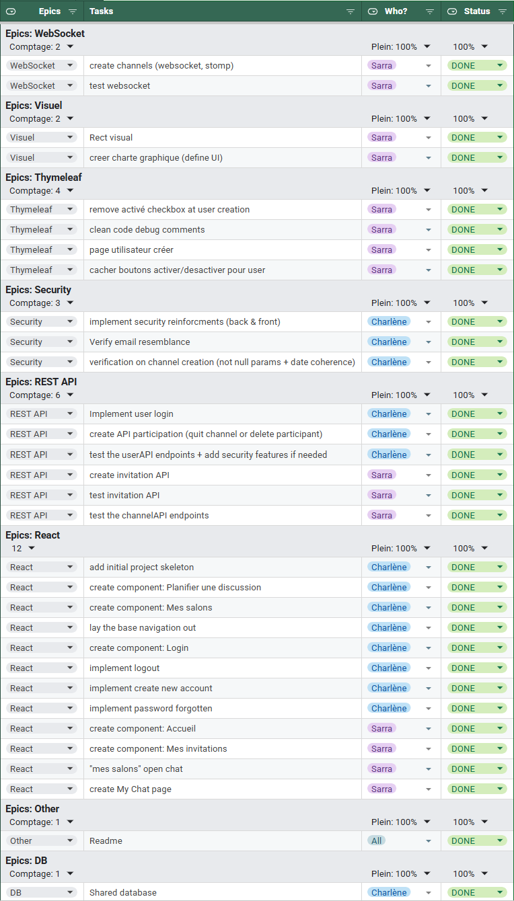

# Application de chat en temps réel

## Présentation du projet

Ce projet a été réalisé dans le cadre de l’UV SR03 (Architecture des applications internet).
L’objectif est de développer une application de discussion en temps réel multi-utilisateurs.
Elle permet entre autres de :

- planifier un salon de discussion à une date donnée ;
- gérer les salons de discussion (gestion des participants, suppression du salon, etc.) ;
- gérer les invitations (accepter ou refuser) ;
- chatter en temps réel dans les salons de discussion.

Le projet est composé de deux parties :

* un backend développé avec Spring Boot ;
* un frontend développé avec React et Vite.

Dépôts Git :

* Backend : https://github.com/CharleneJiang6/sr03-projet
* Frontend : https://github.com/CharleneJiang6/sr03-frontend

---

## Technologies utilisées

### Backend

Le backend repose sur les technologies suivantes :

* Java
* Spring Boot
* Spring MVC
* Spring Data JPA
* WebSocket / STOMP
* SQLite
* Maven

Spring Boot est utilisé pour structurer l’application et faciliter le développement du backend.
Spring MVC permet de gérer les routes web et les contrôleurs.
Spring Data JPA est utilisé pour la couche de persistance et la communication avec la base de données SQLite.
Thymeleaf est utilisé pour l’interface d’administration côté serveur.
WebSocket/STOMP est utilisé pour préparer la communication temps réel entre les utilisateurs.

### Frontend

Le frontend repose sur les technologies suivantes :

* Thymeleaf (pour la partie admin)
* React
* Vite
* JavaScript
* CSS
* npm

React est utilisé pour construire l’interface utilisateur côté client.
Vite permet de lancer rapidement le projet frontend en environnement de développement.

De plus, la bibliothèque `lucid-react` est utilisé pour placer des icônes dans les boutons.

---

## Architecture du projet

### Backend

Le backend suit une architecture en couches :

```text
Controller → Service → Repository → Database
```

L’organisation principale du backend est la suivante :

```text
src/main/java/fr.utc.sr03/
├── controller/
│   ├── ChannelApiController
│   ├── InvitationApiController
│   ├── MessageApiController
│   ├── ParticipationApiController
│   ├── UserApiController
│   └── WebController
├── init/
│   └──  DataInitializer
├── model/
│   ├── dto/
│   ├── enums/
│   ├── ApiResponse
│   ├── Channel
│   ├── Invitation
│   ├── Message
│   ├── Participation
│   └── User
├── repository/
│   ├── ChannelRepository
│   ├── InvitationRepository
│   ├── MessageRepository
│   ├── ParticipationRepository
│   └── UserRepository
├── services/
│   ├── ChannelService
│   ├── InvitationService
│   ├── MessageService
│   ├── ParticipationService
│   ├── PasswordService
│   └── UserService
├── websocket/
│   ├── dto/
│   ├── MessageSocket
│   ├── WebSocketConfig
│   └── WSController
└── Application
```

Les contrôleurs reçoivent les requêtes HTTP ou WebSocket.
Les services contiennent la logique métier.
Les repositories permettent d’interagir avec la base de données.
Les modèles représentent les entités manipulées par l’application.

### Frontend

Le frontend est organisé dans un [dépôt séparé](https://github.com/CharleneJiang6/sr03-frontend) :

```text
sr03-frontend/
├── public/
├── src/
│   ├── assets/
│   ├── App.css
│   ├── App.jsx
│   ├── ChatPage.jsx
│   ├── Constants.jsx
│   ├── ForgotPasswordPage.jsx
│   ├── HomePage.jsx
│   ├── index.css
│   ├── LoginPage.jsx
│   ├── main.jsx
│   ├── ManageMembersModal.jsx
│   ├── MyAllChannelsPage.jsx
│   ├── MyInvitationsPage.jsx
│   ├── PlanChannelPage.jsx
│   └── SignupPage.jsx
├── index.html
├── package.json
├── package-lock.json
└── vite.config.js
```

---

## Fonctionnalités réalisées

### Interface administrateur

La partie administrateur est fonctionnelle.

Elle permet notamment :

* la connexion administrateur ;
* la gestion d’une session administrateur ;
* la création d’utilisateurs ;
* l’affichage de la liste des utilisateurs ;
* la désactivation d’un utilisateur ;
* la réactivation d’un utilisateur ;
* la suppression d’un utilisateur ;
* l’affichage des utilisateurs désactivés ;

L’interface administrateur est réalisée avec Thymeleaf.

### API utilisateurs `UserApiController`

L’API utilisateur permet notamment :

* de récupérer la liste des utilisateurs ;
* de rechercher des utilisateurs selon plusieurs critères ;
* de récupérer un utilisateur par identifiant ;
* de récupérer un utilisateur par adresse mail ;
* de créer un utilisateur ;
* de modifier les informations d’un utilisateur ;
* de modifier le mot de passe d’un utilisateur ;
* de supprimer un utilisateur.

Des vérifications ont été ajoutées, notamment sur l’unicité de l’adresse mail et la sécurité du mot de passe.

### API salons `ChannelApiController`

L’API des salons permet notamment :

* de récupérer les salons ;
* de filtrer les salons selon certains critères ;
* de récupérer un salon par identifiant ;
* de créer un salon ;
* de modifier un salon ;
* de supprimer un salon.

### API participations `ParticipationApiController`
L’API des participations permet notamment :
* d'ajouter une participation (par identifiant ou par email) ;
* de récupérer les participations d’un utilisateur ;
* de récupérer les participations d’un salon ;
* de supprimer une participation.

### API invitations `InvitationApiController`

L’API des invitations permet notamment :

* de créer une invitation ;
* de récupérer les invitations reçues par un utilisateur ;
* de récupérer les invitations envoyées par un utilisateur ;
* d’accepter une invitation ;
* de refuser une invitation ;
* de supprimer une invitation.

Lorsqu’une invitation est acceptée, l’objectif est de permettre à l’utilisateur invité de rejoindre le salon concerné.

### WebSocket / STOMP

Une implémentation WebSocket/STOMP a été mise en place afin de gérer la communication temps réel.

La structure WebSocket contient notamment :

* une configuration WebSocket ;
* un contrôleur WebSocket ;
* un modèle de message socket ;
* des DTO liés aux messages.

---

## Base de données

Le projet utilise une base de données SQLite.

La base de données sert à stocker les principales entités du projet :

* utilisateurs `User` ;
* salons `Channel` ;
* participations `Participation`,
* invitations `Invitation` ;
* messages `Message`.

---

## Lancement du projet

### Lancer le backend

Dans le dossier du backend :

```bash
mvn clean compile
```

Puis lancer l’application depuis l’IDE avec le bouton Run sur la classe principale :

```text
Application.java
```

Le backend se lance sur le port configuré dans le projet Spring Boot.

### Lancer le frontend

Dans le dossier du frontend :

```bash
npm install
npm run dev
```

Le frontend est ensuite accessible en local, généralement à l’adresse suivante :

```text
http://localhost:5173
```

---

## Environnement de test et jeux de données

Pour garantir un environnement de test identique pour tous (étudiants, enseignant),  
l’application fournit un profil Spring `testdata` qui :

- exécute le script `schema.sql` pour créer les tables,
- peuple la base avec des données factices cohérentes, créées via les services métiers  
  (création d’utilisateurs, salons, participations, messages, invitations) : `spring.jpa.hibernate.ddl-auto=update`.

### Lancer l’application avec les données de test

```bash
mvn spring-boot:run -Dspring-boot.run.profiles=testdata
```

### Utilisateurs Réguliers créés

| Email           | Mot de passe |
| --------------- | ------------ |
| alpha@mail.fr   | Alpha*2026   |
| beta@mail.fr    | Beta*2026    |
| gamma@mail.fr   | Gamma*2026   |
| delta@mail.fr   | Delta*2026   |
| epsilon@mail.fr | Epsilon*2026 |
| zeta@mail.fr    | Zeta*2026    |

### Utilisateurs Admin créés
| Email           | Mot de passe |
| --------------- | ------------ |
| jupiter@mail.fr | Jupiter*2026 |
| saturne@mail.fr | Saturne*2026 |
| neptune@mail.fr | Neptune*2026 |


### Salons et messages

Le profil `testdata` crée également plusieurs salons, par exemple :

`All hands Alpha` (type **GROUP**), owner = **Alpha Grec**, incluant tous les utilisateurs créés.
Des messages d’exemple sont créés sur ces salons afin de tester facilement la partie WebSocket / chat temps réel avec plusieurs onglets / clients.

---

## Organisation du travail

Au début du projet, l’organisation du groupe se faisait principalement par WhatsApp et durant les séances de TD.
Chaque membre informait l’autre de l’avancement de ses tâches, des problèmes rencontrés et des éléments ajoutés au
projet.

Nous avons entre autres défini le modèle des données ensemble, ainsi que les routes pour les différentes API/Contrôleurs.
Également, les commits de l'autre membre sont systématiquement revus ou fusionnés avec leur branche courante avant de progresser.

À partir du 15 mai, l’organisation a été davantage structurée grâce à un backlog partagé sous forme de fichier Excel.
Ce backlog permettait de suivre :

* les tâches à réaliser ;
* l’état d’avancement de chaque tâche ;
* la personne responsable ;
* les éléments terminés ;
* les éléments encore à faire.

Les commits Git ont également permis de suivre l’évolution du projet.

## Membres du groupe

Le projet a été réalisé par :

* BOUBAHRI Sarra
* JIANG Charlène

## Contributions des membres

### BOUBAHRI Sarra

#### Backend
- Création initiale de la plupart des repositories et services.
- Implémentation et tests de l’API **Channel**.
- Implémentation et tests de l’API **Invitation**.
- Implémentation de l’API **Message**.
- Implémentation du **WebController** pour la partie Admin.
- Mise en place du **WebSocket/STOMP** pour le chat en temps réel.

#### Partie administrateur (Thymeleaf)
- Amélioration de l’interface administrateur basée sur Thymeleaf.
- Implémentation des fonctionnalités suivantes :
  - Page d'accueil.
  - Affichage de la liste des utilisateurs.
  - Création d’un utilisateur.
  - Désactivation d’un utilisateur.
  - Réactivation d’un utilisateur.
  - Suppression d’un utilisateur.
  - Affichage des utilisateurs désactivés.

#### Frontend (React)
- Création de composants React :
  - page de chat en temps réel,
  - page de gestion des invitations.
- Définition de la charte graphique globale de l’application (palette, typographie, style des composants).
- Structuration initiale du fichier **README**.

---

### JIANG Charlène

#### Backend
- Implémentation et tests de l’API **User**.
- Implémentation et tests de l’API **Participation**.
- Ajout de vérifications de sécurité dans tous les services.
- Création de plusieurs DTO pour le transfert d’objets et la gestion des requêtes entrantes :
`UserDTO`, `ChannelResponseDTO`, `ParticipationDTO`, `CreateUserRequest`, `LoginRequest`, `PasswordUpdateRequest`, `UserUpdateRequest`
- Création de `PasswordService` pour centraliser :
    - le chiffrement / vérification des mots de passe,
    - l’évaluation de la robustesse des mots de passe.
- Mise en place d’un programme d’initialisation et de peuplement de la base de données pour faciliter les tests (`DataInitializer`).


#### Frontend (React)
- Mise en place de la structure de base du projet frontend (squelette des pages et des fonctionnalités principales).
- Intégration du backend dans le frontend pour les fonctionnalités métier.
- Implémentation du flux d’authentification :
    - Connexion / déconnexion.
    - Mot de passe oublié.
    - Création d’un nouveau compte.
- Implémentation de la page d’accueil.
- Implémentation du formulaire de planification de **channel** (création de salon).
- Implémentation de la page “Mes salons” (salons créés / rejoints) avec :
    - filtres par rôle (créateur / participant),
    - filtres par statut (actif / expiré),
    - filtres par type (groupe / privé),
    - tri par date de création ou nom du channel.
- Implémentation de l’invitation de nouveaux membres dans un salon, avec règles métier :
    - salon privé limité à 2 membres,
    - impossibilité d’inviter si le salon est expiré.
- Implémentation de la gestion des membres d’un channel pour le créateur :
    - visualisation des membres,
    - suppression d’un membre avec confirmation,
    - blocage de la gestion des participants par les utilisateurs non créateurs (lecture seule).

Et voici le backlog de suivi pour la deuxième partie du projet :


---

## Pistes d’amélioration

### Sécurité et authentification
- Envoyer un email de confirmation avec **token** lors de la création d’un nouveau compte utilisateur.
- Empêcher un utilisateur de se connecter simultanément plusieurs fois (gestion de sessions actives).
- Pour “mot de passe oublié”, envoyer un email contenant un **token sécurisé** permettant de réinitialiser le mot de passe.
- Protection contre les tentatives de connexion en **brute force** :  
  Pour simplifier, aucune protection n’est implémentée dans ce projet.  
  En production, on utiliserait un système de throttling côté backend  
  (ex : blocage temporaire du compte / de l’IP après *N* tentatives ratées).

### Expérience utilisateur
- Ajouter une page de gestion de compte personnel (mise à jour des informations utilisateur, changement de mot de passe, etc.).
- Classer les salons selon la dernière activité (dernier message) au lieu d’une vue statique.
- Afficher le nombre d'utilisateurs connectés à un salon.
- Rajouter un lien au formulaire de création de salon pour accéder à celui fraîchement créé.
- Supporter l'envoi d'éléments de différentes natures dans un salon (audio, image, vidéo, fichiers).

### API et architecture backend
- Nettoyer et homogénéiser le code backend :
  - manipuler uniquement des **DTO** pour les requêtes entrantes (et non des `Map`),
  - uniformiser la structure des réponses d’API (format d’erreur, messages, codes).

---
## Conclusion

Ce projet nous a permis de mettre en pratique plusieurs notions vues en SR03 : Spring Boot, MVC, REST, persistance avec
JPA, interface Thymeleaf, API backend, communication avec un frontend React et mise en place d’une communication temps
réel avec WebSocket/STOMP.
